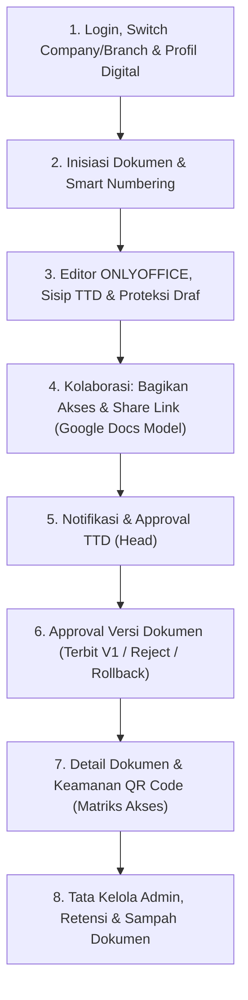

# 📖 PANDUAN MASTER PRESENTASI FITUR DOKUFLOW
> **Alur Komprehensif & Sistematis Dari Login Hingga Terbit (Published)**

---

## 📋 Matriks Akun Demo (Buka di Tab/Browser Berbeda)

| Tab / Browser | Akun Email | Kata Sandi | Role & Fokus Demonstrasi |
| :--- | :--- | :--- | :--- |
| **Tab 1 (Browser Utama)** | `staff.hr@dokuflow.id` | `password` | **Staff HR (Pembuat Dokumen)**: Login, Profil, Switch Context, Penomoran, ONLYOFFICE, Request TTD, Bagikan Akses (Share Link) |
| **Tab 2 (Incognito / Browser 2)** | `head.hr@dokuflow.id` | `password` | **Kepala HR (Penyetuju)**: Notifikasi, Approve TTD, Approve Versi V1, Dokumen Dibagikan, Detail & QR Code |
| **Tab 3 (Cadangan)** | `admin@dokuflow.id` | `Admin123!` | **Administrator**: Master Data, Multi-Company, Retensi, Sampah (Restore/Force Delete) |

---

## 🧭 Diagram Alur Presentasi (*End-to-End Storyline*)



---

# 🚀 PANDUAN LANGKAH DEMO & SCRIPT NARASI

---

### 📍 TAHAP 1: Gerbang Masuk, Autentikasi, Context Switcher & Profil Digital

#### 1. Halaman Login & Aksesibilitas
* 🖥️ **Tampilan**: Halaman Login (`/login`).
* 🖱️ **Aksi**:
  1. Klik tombol **Toggle Dark / Light Mode** di pojok kanan atas.
  2. Klik tombol **Switch Bahasa** (ID $\leftrightarrow$ EN) untuk menunjukkan dukungan multi-bahasa.
  3. Arahkan kursor ke tautan **Lupa Kata Sandi?** (*Password Reset via Email*).
* 🗣️ **Script Narasi**:
  > *"Selamat pagi/siang bapak/ibu penguji. Selamat datang di presentasi sistem **DokuFlow**. Kita memulai presentasi dari gerbang utama, yaitu halaman autentikasi. Halaman ini telah dilengkapi dengan switch tema gelap-terang, lokalisasi bahasa, serta fitur pemulihan akun melalui reset password email."*

#### 2. Login Staff & Context Switcher (Pindah Perusahaan / Cabang)
* 🖱️ **Aksi**:
  1. Masukkan email: `staff.hr@dokuflow.id` dan password: `password`, lalu klik **Masuk**.
  2. Arahkan kursor ke **Context Switcher** di bagian header atas (dropdown Perusahaan & Cabang).
  3. Tunjukkan kemampuan berpindah konteks (misal: PT ABC Kantor Pusat $\leftrightarrow$ Cabang Jakarta $\leftrightarrow$ Cabang Surabaya).
* 🗣️ **Script Narasi**:
  > *"Saat pegawai mengelola lebih dari satu cabang atau anak perusahaan, DokuFlow menyediakan **Context Switcher** di bagian header. Pegawai dapat berpindah cabang kerja secara instan tanpa perlu logout. Seluruh data dokumen, kearsipan, dan format nomor surat akan otomatis terisolasi dan tersaring mengikuti cabang yang sedang aktif."*

#### 3. Setup Identitas Digital (TTD & Stempel Resmi)
* 🖱️ **Aksi**:
  1. Buka menu **Profil** di pojok kiri bawah sidebar (`/profile`).
  2. Tunjukkan form **Update Informasi Akun**, **Ganti Foto Profil**, dan **Update Password**.
  3. Scroll ke bagian **Tanda Tangan & Stempel Resmi**:
     * **Draw Signature**: Peragakan menggambar tanda tangan manual langsung di canvas digital.
     * **Upload Signature**: Tunjukkan opsi unggah file tanda tangan PNG transparan.
     * **Upload Stempel Perusahaan**: Tunjukkan stempel instansi yang tersimpan.
* 🗣️ **Script Narasi**:
  > *"Di DokuFlow, integritas dokumen dijaga melalui identitas digital. Setiap pegawai wajib memiliki tanda tangan resmi—baik digambar langsung pada canvas maupun diunggah sebagai file—serta stempel perusahaan yang sah. Tanpa identitas ini, sistem akan memproteksi pengguna agar tidak dapat menerbitkan dokumen resmi sembarangan."*

---

### 📍 TAHAP 2: Inisiasi Dokumen & Mesin Penomoran Cerdas (Smart Numbering)

#### 4. Pilihan Metode Pembuatan Dokumen
* 🖱️ **Aksi**: Klik menu **Dokumen Saya** $\rightarrow$ Klik tombol **+ Buat Dokumen Baru** (`/documents/choose`).
* 🖥️ **Tampilan**: Halaman *Template Chooser* (bergaya Microsoft Word).
* 🗣️ **Script Narasi**:
  > *"Saat ingin membuat dokumen, pengguna diberikan 3 fleksibilitas: **Membuat Dokumen Manual dari nol**, **Menggunakan Template Resmi Perusahaan**, atau **Mengunggah File DOCX/PDF** yang sudah ada."*

#### 5. Pembedahan Mesin Penomoran (Lama vs Baru vs SOP & Cek Otomatis)
* 🖱️ **Aksi**: Pilih salah satu template (atau klik *Buat Manual*) untuk masuk ke formulir pembuatan.
* 🖥️ **Tampilan**: Formulir pembuatan dokumen (`/documents/create`).
* 🖱️ **Aksi Demonstrasi Penomoran**:
  1. **Format Baru**: Pilih tipe surat umum $\rightarrow$ Tunjukkan nomor dokumen terisi otomatis (contoh: `001/HR/ABC-JKT/IX/2026`).
  2. **Format Lama**: Ubah pilihan ke **Format Lama** $\rightarrow$ Pilih Unit Kerja $\rightarrow$ Tunjukkan format nomor berganti otomatis mengikuti aturan lama.
  3. **Penomoran Khusus SOP**: Pilih tipe dokumen **SOP** $\rightarrow$ Tunjukkan nomor berubah mengikuti format baku SOP (Lama & Baru).
  4. **Pengecekan Otomatis (*Anti-Duplicate Check*)**: Tunjukkan indikator verifikasi hijau bahwa nomor tersebut belum pernah digunakan dan valid.
* 🗣️ **Script Narasi**:
  > *"Salah satu keunggulan inti DokuFlow adalah **Smart Numbering Engine**. Sistem secara dinamis mendukung format penomoran Baru, penomoran Lama berbasis Unit Kerja, hingga penomoran khusus SOP. Sistem melakukan pengecekan real-time di database untuk menjamin tidak akan pernah terjadi nomor surat ganda atau bentrok antar-divisi."*

---

### 📍 TAHAP 3: Editor ONLYOFFICE, Kolaborasi TTD, & Proteksi Draf

#### 6. Pengalaman Editor & Penyisipan Tanda Tangan
* 🖱️ **Aksi**: Isi judul dokumen (misal: *SOP Rekrutmen Pegawai Baru 2026*), lalu klik **Lanjut ke Editor**.
* 🖥️ **Tampilan**: Jendela editor **ONLYOFFICE**.
* 🖱️ **Aksi**:
  1. Tunjukkan fitur formatting Word standar industri (teks, tabel, layout).
  2. **Sisipkan TTD & Stempel Sendiri**: Klik tombol sisipkan TTD $\rightarrow$ Tanda tangan dan stempel staf langsung tertempel di dokumen.
  3. **Minta TTD Orang Lain (Request TTD Tanpa Placeholder)**:
     * Pilih pejabat yang berwenang (contoh: **Siti Kepala HR**).
     * Klik **Minta TTD** $\rightarrow$ Sistem tidak memasukkan placeholder sementara ke dokumen, melainkan langsung mengirimkan **Notifikasi Permintaan Izin TTD** ke akun target dan memunculkan konfirmasi sukses di layar pemohon.
* 🗣️ **Script Narasi**:
  > *"Di dalam editor ONLYOFFICE berbasis browser, staf dapat menyusun dokumen dengan tools pengolah kata lengkap. Staf dapat menempelkan tanda tangan & stempelnya sendiri, serta meminta tanda tangan pimpinan/rekan kerja. Sistem tidak mengotori dokumen dengan teks placeholder sementara, melainkan langsung mengirimkan notifikasi izin resmi ke akun penerima."*

#### 7. Proteksi Navigasi (*Leave Editor Protection*) & Auto-Draft
* 🖱️ **Aksi**: Coba klik tombol **Back** pada browser tanpa menekan tombol simpan.
* 🖥️ **Tampilan**: **Modal Peringatan Muncul**: *"Perubahan belum disimpan. Apakah Anda yakin ingin meninggalkan halaman?"*
* 🖱️ **Aksi**: Klik keluar/batal $\rightarrow$ Tunjukkan dokumen otomatis berstatus **Draf** (*Draft*) di daftar dokumen.
* 🖱️ **Aksi Lanjutan**: Buka kembali dokumen tersebut $\rightarrow$ Klik **Simpan & Ajukan Persetujuan**.
* 🖥️ **Tampilan**: Muncul notifikasi pop-up: *"Dokumen berhasil disimpan dan akan diajukan untuk di-Approve oleh Siti Kepala HR."*
* 🗣️ **Script Narasi**:
  > *"DokuFlow memiliki fitur keselamatan data. Jika pengguna tidak sengaja menutup tab atau menekan tombol kembali, modal proteksi akan muncul dan dokumen secara otomatis diamankan dalam status Draf. Saat disimpan final, sistem langsung mengarahkan dokumen ke meja persetujuan pejabat terkait."*

---

### 📍 TAHAP 4: Kolaborasi Berbagi Akses & Tautan (Google Docs Sharing Model)

#### 8. Modal Bagikan Akses (*Share Modal*) & Salin Tautan (*Share Link*)
* 🖱️ **Aksi**: Buka halaman detail dokumen atau klik tombol **Bagikan (Share)** pada dokumen yang baru dibuat.
* 🖥️ **Tampilan**: Modal Bagikan Dokumen (*Google Docs Style*).
* 🖱️ **Aksi Demonstrasi**:
  1. **Bagikan ke Pengguna / Divisi Spesifik**: Cari nama rekan atau pilih divisi $\rightarrow$ Tentukan hak akses: **Viewer** (Lihat saja), **Commenter**, atau **Editor**.
  2. **Akses Umum (*General Access*)**:
     * Ubah dari *Dibatasi (Restricted)* menjadi *Siapa saja yang memiliki tautan (Anyone with the link)*.
  3. **Salin Tautan Berbagi (*Copy Share Link*)**:
     * Klik tombol **Salin Tautan** $\rightarrow$ Tunjukkan URL berbagi bertoken unik (`/shared/{token}`).
     * Tunjukkan tombol **Regenerate Token** (untuk memperbarui token tautan jika ingin mencabut akses lama).
  4. **Menu Dokumen Dibagikan (*Shared with Me*)**:
     * Arahkan kursor ke menu sidebar **Dokumen Dibagikan** $\rightarrow$ Tunjukkan badge notifikasi merah yang menghitung jumlah dokumen baru yang dibagikan kepada pengguna.
* 🗣️ **Script Narasi**:
  > *"Untuk memudahkan kolaborasi internal, DokuFlow mengadopsi model pembagian hak akses modern seperti Google Docs. Pemilik dokumen dapat membagikan akses ke orang tertentu atau seluruh divisi dengan peran Viewer, Commenter, atau Editor. Pemilik juga dapat membuat tautan akses aman (*Share Link*) dengan token kriptografis yang dapat diperbarui kapan saja."*

---

### 📍 TAHAP 5: Sudut Pandang Penyetuju (Approval TTD & Siklus Versi Dokumen)

#### 9. Penyetuju Menerima Notifikasi & Approve TTD
* 🖱️ **Aksi**: **Pindah ke Tab 2** (Login sebagai `head.hr@dokuflow.id`).
* 🖥️ **Tampilan**: Dashboard Kepala HR.
* 🖱️ **Aksi**:
  1. Tunjukkan **Ikon Lonceng Notifikasi** yang menyala dengan badge merah.
  2. Buka menu **Persetujuan TTD**:
     * Terlihat permohonan TTD dari staf tadi.
     * Tunjukkan tombol **Accept (Setujui)** dan **Reject (Tolak)**.
     * Klik **Accept TTD**.
* 🗣️ **Script Narasi**:
  > *"Sekarang kita beralih ke layar Kepala HR. Notifikasi langsung masuk secara real-time. Pimpinan dapat memeriksa draf dan menyetujui pembubuhan tanda tangan resminya. Jika ditolak, pembuat dokumen akan menerima notifikasi bahwa permohonan TTD ditolak beserta alasannya."*

#### 10. Pusat Approval Dokumen & Logika Versioning (V1, Reject, Rollback)
* 🖱️ **Aksi**: Buka menu **Approval > Document Approval (Version)** (`/approvals/versions`).
* 🖥️ **Tampilan**: Daftar dokumen yang menunggu persetujuan versi.
* 🖱️ **Aksi & Penjelasan 3 Skenario**:
  1. **Skenario 1: Approve (Penerbitan V1)**:
     * Klik tombol **Approve**.
     * Tunjukkan status dokumen kini berubah menjadi **ACTIVE / PUBLISHED**, dan versinya resmi menjadi **Versi 1 (V1)**.
  2. **Skenario 2: Logika Penolakan (*Reject*)**:
     * *(Jelaskan secara lisan)*: *"Jika dokumen ini adalah dokumen baru dan di-Reject, sistem otomatis memindahkannya ke **Sampah (Soft Delete)**. Namun jika ini dokumen revisi (V2 ke atas) yang ditolak, sistem otomatis mengembalikannya ke versi aktif sebelumnya."*
  3. **Skenario 3: Rollback Approval**:
     * Tunjukkan tab **Rollback Approval**: *"Jika suatu saat terjadi revisi keliru di masa depan, staf dapat mengajukan Rollback ke versi lama yang harus disetujui kembali oleh pimpinan."*
* 🗣️ **Script Narasi**:
  > *"Dengan sistem kendali versi yang ketat ini, tidak ada dokumen yang bisa terbit tanpa persetujuan pimpinan, dan setiap riwayat revisi terlindungi secara transparan."*

---

### 📍 TAHAP 6: Detail Dokumen & Matriks Keamanan QR Code

#### 11. Halaman Detail Dokumen & Audit Trail
* 🖱️ **Aksi**: Klik dokumen yang baru saja disetujui untuk membuka halaman **Detail Dokumen** (`/documents/{id}`).
* 🖥️ **Tampilan**: Metadata dokumen, log riwayat versi (V1), waktu persetujuan, dan pratinjau file PDF/Word.
* 🗣️ **Script Narasi**:
  > *"Pada halaman Detail Dokumen, kita dapat melihat identitas lengkap: nomor surat resmi, tanggal approval, riwayat tanda tangan yang sudah tertempel, dan tombol pratinjau file."*

#### 12. Pembuktian Keamanan Akses QR Code saat di-Scan
* 🖥️ **Tampilan**: Tunjukkan **QR Code** yang tertera pada dokumen.
* 🖱️ **Aksi**: Buka URL verifikasi QR Code (`/d/{token}`).
* 🗣️ **Script Narasi & Demonstrasi Matriks Hak Akses**:
  > *"Inilah fitur verifikasi QR Code DokuFlow yang menerapkan matriks keamanan bertingkat:
  > 1. **Wajib Terautentikasi**: Pengguna harus login terlebih dahulu untuk mengakses pratinjau dokumen internal.
  > 2. **Dokumen General (Umum)**: Semua staf internal yang login dapat melihat pratinjau dokumen.
  > 3. **Dokumen Division Only**: Hanya anggota dari divisi yang sama (misal: HR) yang diizinkan membuka pratinjau. Staf dari divisi IT atau Finance yang mencoba membuka akan diblokir oleh sistem dengan pesan akses ditolak.
  > 4. **Dokumen Restricted / Specific Shares**: Hanya pengguna-pengguna spesifik yang telah diberi hak akses pada menu pembagian (*Share*) yang dapat membaca isinya."*

---

### 📍 TAHAP 7: Fitur Administrator & Tata Kelola Perusahaan

#### 13. Master Data Organisasi & Kebijakan Retensi
* 🖱️ **Aksi**: **Pindah ke Tab 3** (Akun `admin@dokuflow.id`).
* 🖥️ **Tampilan**: Panel Menu Administrasi.
* 🖱️ **Aksi**:
  1. Perlihatkan master data: **Perusahaan, Cabang, Unit Kerja, Divisi, dan Pengguna**.
  2. Buka menu **Template Dokumen**: Tunjukkan bagaimana admin menyediakan template standar untuk seluruh divisi.
  3. Buka menu **Retensi Dokumen**: Tunjukkan pengaturan masa simpan aktif dokumen sebelum kedaluwarsa secara otomatis.
* 🗣️ **Script Narasi**:
  > *"Di balik kemudahan pengguna, Administrator memiliki kendali penuh terhadap master data struktur organisasi lintas anak perusahaan dan cabang, penyediaan template baku, serta penetapan kebijakan masa retensi dokumen."*

#### 14. Sampah Dokumen (*Trash Bin & Recovery*)
* 🖱️ **Aksi**: Buka menu **Sampah** (`/trash`).
* 🖥️ **Tampilan**: Daftar dokumen yang telah dihapus (*Soft Deleted*).
* 🖱️ **Aksi**:
  1. Tunjukkan dokumen yang terhapus/ditolak berada di sini.
  2. Tunjukkan tombol **Restore** (memulihkan dokumen kembali aktif) dan **Force Delete** (menghapus tuntas dari database).
* 🗣️ **Script Narasi**:
  > *"Untuk mencegah kehilangan dokumen penting akibat kelalaian, DokuFlow menyediakan fitur Sampah Dokumen dengan kemampuan pemulihan instan (*Restore*) maupun pembersihan permanen (*Force Delete*)."*

---

### 🎯 TAHAP 8: Penutup & Tanya Jawab (30 Detik)

* 🗣️ **Script Penutup**:
  > *"Demikianlah alur komprehensif DokuFlow: mulai dari autentikasi dan penyiapan tanda tangan digital, fleksibilitas pergantian cabang kerja, pembuatan dengan penomoran cerdas dan editor ONLYOFFICE, kolaborasi berbagi hak akses Google Docs model, persetujuan dan pembubuhan tanda tangan berjenjang, hingga penerbitan resmi dengan verifikasi QR Code yang aman dan tata kelola kearsipan enterprise.
  > 
  > Terima kasih atas perhatian bapak/ibu sekalian. Saya membuka sesi untuk tanya jawab."*

---

# 📌 CONTEKAN KILAT DI SISI MONITOR

```
[01] Tab Staff  -> Login, Dark/Lang, Switch Company/Branch, Profil (TTD/Stempel)
[02] Tab Staff  -> Buat Dokumen, Pilih Template, Tes Nomor (Lama/Baru/SOP)
[03] Tab Staff  -> Masuk ONLYOFFICE, Sisip TTD Sendiri, Request TTD Pimpinan
[04] Tab Staff  -> Tes Modal Back (Draf Tersimpan), Klik Simpan Final
[05] Tab Staff  -> Modal Bagikan Akses (Viewer/Editor, Copy Share Link bertoken)
[06] Tab Head   -> Buka Lonceng Notif, Menu Persetujuan TTD (Accept)
[07] Tab Head   -> Menu Approval Versi (Klik Approve -> Terbit V1)
[08] Tab Head   -> Detail Dokumen, Tes QR Code & Jelaskan Matriks Hak Akses
[09] Tab Admin  -> Master Organisasi, Retensi, & Sampah (Restore/Force Delete)
```
