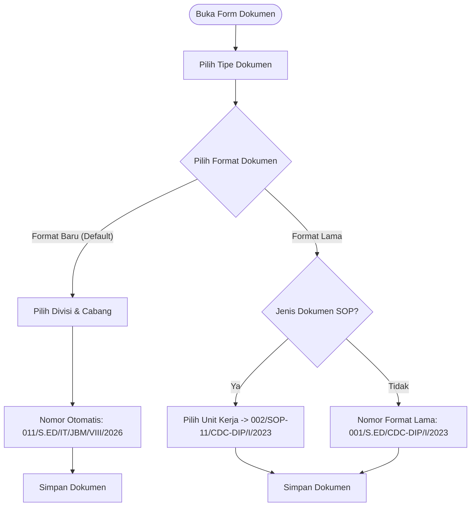

# Implementasi Penomoran Dokumen: Pemilihan Format Dokumen (Format Baru vs Format Lama)

## 1. Ringkasan Keputusan & Konsep UI

Form dokumen menyediakan kontrol UI berbentuk **Segmented Control / Radio Cards** untuk menentukan **Format Penomoran Dokumen**:

1. **Format Baru (Default):**
   - Menggunakan standar penomoran terpadu terbaru (membutuhkan input Divisi).
   - Nomor dokumen di-generate otomatis oleh counter sistem.

2. **Format Lama:**
   - Menggunakan format penomoran terdahulu.
   - Khusus jenis dokumen SOP, membutuhkan input Unit Kerja.
   - Nomor dokumen di-generate/di-input sesuai format penomoran terdahulu.

---

## 2. Aturan Format Penomoran

### 2.1 Pilihan = "Format Lama"

**A. Semua jenis dokumen KECUALI SOP:**
```
{urut}/{kode_jenis_dokumen}/{kode_cabang}/{bulan_romawi}/{tahun}
```

| Segmen | Contoh | Keterangan |
|---|---|---|
| urut | `001` | Nomor urut |
| kode_jenis_dokumen | `S.ED`, dll | Master Document Type |
| kode_cabang | `CDC-DIP` | Master Branch |
| bulan_romawi | `I` | Bulan terbit |
| tahun | `2023` | Tahun terbit |

*Contoh:* `001/S.ED/CDC-DIP/I/2023`

---

**B. Khusus SOP (Format Lama):**
```
{urut}/SOP-{kode_unit_kerja}/{kode_cabang}/{bulan_romawi}/{tahun}
```
> *Catatan:* Pada format lama SOP, jenis dokumen (`SOP`) dan kode unit kerja digabung dengan tanda strip (`-`).

| Segmen | Contoh | Keterangan |
|---|---|---|
| urut | `002` | Nomor urut |
| SOP-kode_unit_kerja | `SOP-11` | Digabung tanda strip |
| kode_cabang | `CDC-DIP` | Master Branch |
| bulan_romawi | `I` | Bulan terbit |
| tahun | `2023` | Tahun terbit |

*Contoh:* `002/SOP-11/CDC-DIP/I/2023`

---

### 2.2 Pilihan = "Format Baru"

**Berlaku SAMA untuk SEMUA jenis dokumen (termasuk SOP tanpa pengecualian):**
```
{urut}/{kode_jenis_dokumen}/{kode_divisi}/{kode_cabang}/{bulan_romawi}/{tahun}
```

| Segmen | Contoh | Keterangan |
|---|---|---|
| urut | `011` | Auto-generated dari counter sistem (3 digit padding) |
| kode_jenis_dokumen | `S.ED` / `SOP` | Master Document Type |
| kode_divisi | `IT` | Master Division (wajib diisi) |
| kode_cabang | `JBM` | Master Branch |
| bulan_romawi | `VIII` | Bulan dokumen |
| tahun | `2026` | Tahun dokumen |

*Contoh Non-SOP:* `011/S.ED/IT/JBM/VIII/2026`  
*Contoh SOP:* `011/SOP/IT/JBM/VIII/2026` (Struktur seragam, Divisi dan SOP terpisah rapi).

---

## 3. Matriks Field Form & Perilaku Input

| Komponen Form | Format Baru (Default) | Format Lama |
|---|---|---|
| **Pilihan Mode (UI)** | `[●] Format Baru` | `[○] Format Lama` |
| **Deskripsi / Helper** | *"Penomoran standar baru terpadu dengan kode divisi"* | *"Penomoran menggunakan format terdahulu"* |
| **Tipe Dokumen** | Wajib dipilih | Wajib dipilih |
| **Nomor Dokumen** | **Auto-preview / Generated** | **Auto-preview / Generated** |
| **Divisi** | **Muncul & Wajib** (semua jenis dokumen) | Tidak muncul |
| **Unit Kerja** | Tidak muncul | **Muncul & Wajib HANYA jika SOP** |
| **Perusahaan & Cabang**| Wajib dipilih | Wajib dipilih |
| **Tanggal Dokumen** | Default: Tanggal hari ini | Sesuai tanggal dokumen |
| **Upload Dokumen Fisik**| Opsional (jika diunggah, nomor dapat diedit manual) | Opsional (jika diunggah, nomor dapat diedit manual) |
| **Nilai `numbering_scheme`** | `new_format` | `legacy_general` atau `legacy_sop` |

---

## 4. Logic Service Layer (Generator & Handler)

```php
namespace App\Services;

use App\Models\DocumentType;
use App\Models\Branch;
use App\Models\Division;
use App\Models\WorkUnit;
use App\Helpers\MonthToRoman;
use Carbon\Carbon;

class DocumentNumberService
{
    /**
     * Generate preview atau final document number.
     */
    public function generateNumber(
        string $formatChoice, // 'baru' | 'lama'
        DocumentType $type,
        Branch $branch,
        ?Division $division,
        ?WorkUnit $workUnit,
        Carbon $date,
        ?string $manualSequence = null
    ): string {
        $roman = MonthToRoman::convert($date->month);
        $year = $date->year;

        // 1. FORMAT BARU
        if ($formatChoice === 'baru') {
            $nextSeq = $this->getNextCounter($type->id, $branch->id, $year);
            $sequence = str_pad($nextSeq, 3, '0', STR_PAD_LEFT);
            $divCode = $division ? $division->code : 'XXX';

            return "{$sequence}/{$type->code}/{$divCode}/{$branch->code}/{$roman}/{$year}";
        }

        // 2. FORMAT LAMA
        $sequence = $manualSequence ?? '001';

        if ($type->code === 'SOP') {
            $unitCode = $workUnit ? $workUnit->code : 'XX';
            return "{$sequence}/SOP-{$unitCode}/{$branch->code}/{$roman}/{$year}";
        }

        return "{$sequence}/{$type->code}/{$branch->code}/{$roman}/{$year}";
    }
}
```

---

## 5. Validasi

1. **Integritas Nomor:**
   - **Format Baru:** Nomor otomatis konsisten dengan template dan urut per (`year`, `branch_id`, `document_type_id`).
   - **Upload Berkas Fisik:** Nomor manual divalidasi keunikan (`unique:documents,document_number`).
2. **Kondisional Field:**
   - Jika `format_choice = baru` → `division_id` **wajib diisi**.
   - Jika `format_choice = lama` dan `document_type = SOP` → `unit_kerja_id` **wajib diisi**.

---

## 6. Struktur Database

- **`documents` Table:**
  - `format_choice` (`enum: ['baru', 'lama']`, default: `'baru'`)
  - `numbering_scheme` (`enum: ['new_format', 'legacy_general', 'legacy_sop']`)
  - `document_number` (`string`, unique)
  - `division_id` (`nullable`, foreign key ke `divisions`)
  - `unit_kerja_id` (`nullable`, foreign key ke `unit_kerjas`)
- **`document_number_counters` Table:**
  - Kunci: `(year, branch_id, document_type_id)`
  - Di-increment saat dokumen `format_choice = 'baru'` disimpan.

---

## 7. Diagram Alur Proses


